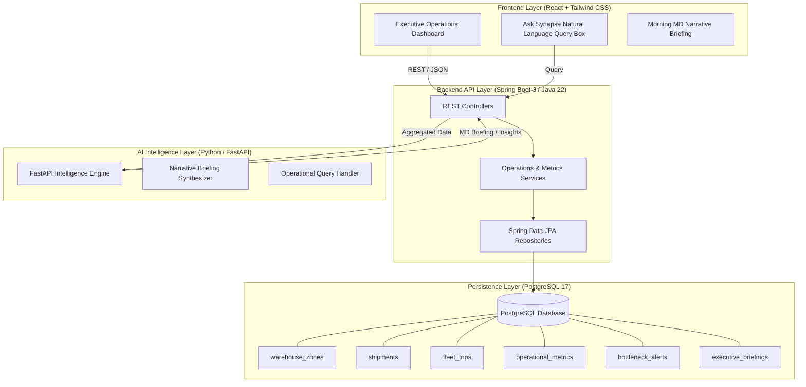

# Implementation Plan: DP World Synapse (Kigali Dry Port Intelligence)

## Executive Summary & Solution Architecture
**DP World Synapse** is an executive operations and logistics intelligence platform purpose-built for **DP World Kigali** (Inland Dry Port & Warehousing Hub at Masaka, Rwanda). It bridges real-time yard, warehouse, customs, and corridor fleet operations with executive decision-making.



---

## Project Structure Overview
```
dpsynapse/
├── .agents/
│   └── rules/
│       └── synapse-rules.md
├── db/
│   ├── 01_schema.sql                  # DDL with snake_case tables, indexes, triggers
│   └── 02_seed_data.sql               # Rich seed dataset for DP World Kigali (Masaka)
├── backend/                           # Spring Boot 3.x (Java 22 + Maven)
│   ├── pom.xml
│   ├── src/main/java/com/dpworld/synapse/
│   │   ├── SynapseApplication.java
│   │   ├── config/                    # CORS, Swagger/OpenAPI, WebClient
│   │   ├── controller/                # REST endpoints (KPIs, Warehouse, Shipments, Fleet, AI)
│   │   ├── dto/                       # Request/Response payloads (camelCase)
│   │   ├── entity/                    # JPA Entities (snake_case mapping)
│   │   ├── exception/                 # Global exception handler & RFC-7807 responses
│   │   ├── repository/                # Spring Data JPA interfaces
│   │   └── service/                   # Business logic, aggregations, AI client
│   └── src/main/resources/
│       ├── application.yml
│       └── db/migration/              # Flyway / SQL initialization scripts
├── ai-service/                        # Python 3.12 / FastAPI microservice
│   ├── requirements.txt
│   ├── app/
│   │   ├── main.py
│   │   ├── briefing_engine.py
│   │   └── prompt_templates.py
└── frontend/                          # Executive Dashboard (React + Vite + Tailwind CSS)
    ├── package.json
    ├── tailwind.config.js
    └── src/
        ├── components/                # Macro KPIs, Zone Map, Customs Radar, Corridor Fleet
        ├── services/                  # API clients
        └── App.jsx
```

---

## Part 1: PostgreSQL Database Schema Specification

### 1.1 Table Definitions (Strict `snake_case`)
1. **`warehouse_zones`**:
   - `id`: BIGSERIAL PRIMARY KEY
   - `zone_code`: VARCHAR(50) UNIQUE NOT NULL (e.g., `ZONE-A-BONDED`, `ZONE-B-NONBONDED`, `ZONE-C-BULK`, `ZONE-D-COLD`, `ZONE-E-HAZMAT`, `ZONE-F-EMPTY`)
   - `zone_name`: VARCHAR(100) NOT NULL (e.g., `Bonded CFS & Import Holding`, `Cold Chain Pharma & Fresh Hub`)
   - `zone_type`: VARCHAR(50) NOT NULL (`BONDED`, `NON_BONDED`, `COLD_CHAIN`, `CFS`, `EMPTY_YARD`, `HAZMAT`)
   - `total_capacity_sqm`: NUMERIC(10, 2)
   - `total_capacity_teu`: INT
   - `current_occupancy_teu`: INT NOT NULL DEFAULT 0
   - `temperature_celsius`: NUMERIC(4, 1) (nullable; monitored for cold chain)
   - `target_temp_min`: NUMERIC(4, 1)
   - `target_temp_max`: NUMERIC(4, 1)
   - `status`: VARCHAR(30) NOT NULL DEFAULT 'OPTIMAL' (`OPTIMAL`, `NEAR_CAPACITY`, `CONGESTED`, `MAINTENANCE`)
   - `created_at`: TIMESTAMPTZ NOT NULL DEFAULT NOW()
   - `updated_at`: TIMESTAMPTZ NOT NULL DEFAULT NOW()

2. **`shipments`**:
   - `id`: BIGSERIAL PRIMARY KEY
   - `tracking_number`: VARCHAR(64) UNIQUE NOT NULL (e.g., `DPW-KGL-2026-1042`)
   - `container_number`: VARCHAR(32) NOT NULL (e.g., `MSKU8291034`, `CMAU9182301`)
   - `seal_number`: VARCHAR(32)
   - `shipping_line`: VARCHAR(50) NOT NULL (e.g., `Maersk`, `CMA CGM`, `MSC`, `Hapag-Lloyd`)
   - `consignee_name`: VARCHAR(150) NOT NULL (e.g., `Bralirwa Plc`, `Rwanda Tea Authority`, `Inyange Industries`)
   - `origin_port`: VARCHAR(100) NOT NULL (`Mombasa Port`, `Dar es Salaam Port`)
   - `destination_hub`: VARCHAR(100) NOT NULL DEFAULT 'DP World Masaka'
   - `corridor`: VARCHAR(50) NOT NULL (`CENTRAL_CORRIDOR`, `NORTHERN_CORRIDOR`, `REGIONAL_FEEDER`)
   - `cargo_type`: VARCHAR(50) NOT NULL (`FCL`, `LCL`, `BULK`, `COLD_CHAIN`, `HAZMAT`, `GENERAL_CARGO`)
   - `commodity_description`: TEXT
   - `weight_kg`: NUMERIC(10, 2) NOT NULL
   - `teu_count`: INT NOT NULL DEFAULT 1
   - `customs_channel`: VARCHAR(20) NOT NULL (`GREEN`, `YELLOW`, `RED`, `BLUE`)
   - `customs_status`: VARCHAR(40) NOT NULL (`PENDING_DECLARATION`, `DOCUMENT_VERIFICATION`, `PHYSICAL_SCAN`, `CLEARED`, `CUSTOMS_HOLD`)
   - `stage`: VARCHAR(40) NOT NULL (`CORRIDOR_TRANSIT`, `BORDER_CROSSING`, `YARD_GATE_IN`, `INSPECTION_BAY`, `WAREHOUSE_STORED`, `GATE_OUT_DELIVERED`)
   - `warehouse_zone_id`: BIGINT REFERENCES `warehouse_zones(id)`
   - `eta`: TIMESTAMPTZ
   - `gate_in_at`: TIMESTAMPTZ
   - `customs_cleared_at`: TIMESTAMPTZ
   - `gate_out_at`: TIMESTAMPTZ
   - `dwell_time_hours`: NUMERIC(8, 2) GENERATED ALWAYS AS (
       CASE 
         WHEN gate_out_at IS NOT NULL AND gate_in_at IS NOT NULL THEN EXTRACT(EPOCH FROM (gate_out_at - gate_in_at)) / 3600.0
         WHEN gate_in_at IS NOT NULL THEN EXTRACT(EPOCH FROM (NOW() - gate_in_at)) / 3600.0
         ELSE 0.0
       END
     ) STORED
   - `created_at`: TIMESTAMPTZ NOT NULL DEFAULT NOW()
   - `updated_at`: TIMESTAMPTZ NOT NULL DEFAULT NOW()

3. **`fleet_trips`**:
   - `id`: BIGSERIAL PRIMARY KEY
   - `trip_number`: VARCHAR(50) UNIQUE NOT NULL (e.g., `TRIP-2026-8831`)
   - `truck_plate`: VARCHAR(30) NOT NULL (e.g., `RAD 492 K`, `KBH 102 Z`)
   - `trailer_number`: VARCHAR(30)
   - `driver_name`: VARCHAR(100) NOT NULL
   - `driver_phone`: VARCHAR(30)
   - `transporter_company`: VARCHAR(100) NOT NULL
   - `corridor`: VARCHAR(50) NOT NULL (`CENTRAL_CORRIDOR`, `NORTHERN_CORRIDOR`, `CROSS_BORDER_DRC`)
   - `origin_location`: VARCHAR(100) NOT NULL (e.g., `Dar es Salaam Port`, `Mombasa Port`)
   - `current_checkpoint`: VARCHAR(100) NOT NULL (e.g., `Rusumo Border Post`, `Kagitumba`, `Kabanga`, `Masaka Gate`)
   - `status`: VARCHAR(40) NOT NULL (`DISPATCHED`, `IN_TRANSIT`, `BORDER_HOLD`, `GATE_IN_MASAKA`, `UNLOADING`, `DEPARTED`)
   - `departure_time`: TIMESTAMPTZ
   - `border_arrival_time`: TIMESTAMPTZ
   - `gate_in_time`: TIMESTAMPTZ
   - `gate_out_time`: TIMESTAMPTZ
   - `turnaround_time_minutes`: INT (computed as minutes from `gate_in_time` to `gate_out_time`)
   - `delay_reason`: TEXT
   - `created_at`: TIMESTAMPTZ NOT NULL DEFAULT NOW()
   - `updated_at`: TIMESTAMPTZ NOT NULL DEFAULT NOW()

4. **`operational_metrics`**:
   - `id`: BIGSERIAL PRIMARY KEY
   - `metric_date`: DATE UNIQUE NOT NULL
   - `teu_inbound_today`: INT NOT NULL DEFAULT 0
   - `teu_outbound_today`: INT NOT NULL DEFAULT 0
   - `teu_in_yard`: INT NOT NULL DEFAULT 0
   - `avg_truck_turnaround_mins`: NUMERIC(6, 1) NOT NULL DEFAULT 0.0
   - `avg_dwell_time_days`: NUMERIC(5, 2) NOT NULL DEFAULT 0.0
   - `bonded_utilization_pct`: NUMERIC(5, 2) NOT NULL DEFAULT 0.0
   - `non_bonded_utilization_pct`: NUMERIC(5, 2) NOT NULL DEFAULT 0.0
   - `cold_chain_utilization_pct`: NUMERIC(5, 2) NOT NULL DEFAULT 0.0
   - `customs_clearance_rate_pct`: NUMERIC(5, 2) NOT NULL DEFAULT 0.0
   - `active_bottlenecks_count`: INT NOT NULL DEFAULT 0
   - `recorded_at`: TIMESTAMPTZ NOT NULL DEFAULT NOW()

5. **`bottleneck_alerts`**:
   - `id`: BIGSERIAL PRIMARY KEY
   - `alert_type`: VARCHAR(50) NOT NULL (`CUSTOMS_RED_CHANNEL_SURGE`, `COLD_CHAIN_TEMP_ANOMALY`, `BORDER_CROSSING_CONGESTION`, `GATE_QUEUE_OVERFLOW`, `YARD_HIGH_DENSITY`)
   - `severity`: VARCHAR(20) NOT NULL (`CRITICAL`, `HIGH`, `MEDIUM`, `LOW`)
   - `title`: VARCHAR(150) NOT NULL
   - `description`: TEXT NOT NULL
   - `affected_zone_or_corridor`: VARCHAR(100)
   - `status`: VARCHAR(30) NOT NULL DEFAULT 'ACTIVE' (`ACTIVE`, `INVESTIGATING`, `RESOLVED`)
   - `impact_summary`: TEXT
   - `suggested_action`: TEXT
   - `created_at`: TIMESTAMPTZ NOT NULL DEFAULT NOW()
   - `resolved_at`: TIMESTAMPTZ

6. **`executive_briefings`**:
   - `id`: BIGSERIAL PRIMARY KEY
   - `briefing_date`: DATE NOT NULL
   - `generated_at`: TIMESTAMPTZ NOT NULL DEFAULT NOW()
   - `title`: VARCHAR(200) NOT NULL
   - `executive_summary`: TEXT NOT NULL
   - `operational_highlights`: JSONB NOT NULL DEFAULT '[]'::jsonb
   - `critical_risks`: JSONB NOT NULL DEFAULT '[]'::jsonb
   - `strategic_recommendations`: JSONB NOT NULL DEFAULT '[]'::jsonb
   - `raw_kpi_snapshot`: JSONB NOT NULL DEFAULT '{}'::jsonb

---

## Part 2: Backend API (Spring Boot 3.3 / Java 22)

### 2.1 Dependencies & Technology Stack
- **Framework:** Spring Boot 3.3.x / Java 22
- **Persistence:** Spring Data JPA + PostgreSQL JDBC Driver + Flyway
- **Web & Tools:** Spring Web MVC, Lombok, Validation (`jakarta.validation`), Jackson
- **Docs:** Springdoc OpenAPI (Swagger UI at `/swagger-ui.html`)
- **Reactive Client:** Spring WebClient for AI microservice communication

### 2.2 REST Endpoints Architecture
| HTTP Method | Endpoint | Description | Query Parameters / Body |
|---|---|---|---|
| `GET` | `/api/v1/kpi/summary` | Executive macro KPI counters & target deltas | None |
| `GET` | `/api/v1/kpi/trends` | 14-day historical trend for TEU, TAT, and Dwell | `?days=14` |
| `GET` | `/api/v1/warehouse-zones` | Zone-by-zone utilization, capacity & thermal telemetry | None |
| `GET` | `/api/v1/shipments` | Filtered & paginated shipment manifest | `?channel=RED&stage=YARD_GATE_IN&page=0&size=20` |
| `GET` | `/api/v1/shipments/{id}` | Detailed shipment tracking & customs timeline | Path `id` |
| `GET` | `/api/v1/fleet/trips` | Active corridor fleet telemetry & border status | `?corridor=CENTRAL_CORRIDOR&status=IN_TRANSIT` |
| `GET` | `/api/v1/fleet/stats` | Truck turnaround time distribution & corridor metrics | None |
| `GET` | `/api/v1/bottlenecks` | Real-time bottleneck alerts & operational risks | `?status=ACTIVE` |
| `GET` | `/api/v1/briefings/latest` | Latest MD Morning Executive Briefing | None |
| `POST` | `/api/v1/briefings/generate` | Trigger AI briefing generation for target date | `{ "date": "2026-10-05" }` |
| `POST` | `/api/v1/ai/ask` | Natural language operational assistant query | `{ "query": "Why is truck turnaround delayed at Rusumo?" }` |

---

## Part 3: AI Intelligence Microservice (Python / FastAPI)
- Aggregates live data payload from Spring Boot backend.
- Compiles the **Managing Director's Daily 07:00 Masaka Briefing**:
  - Highlights Central (Dar) vs Northern (Mombasa) corridor flow.
  - Flags customs inspection queue bottlenecks (RRA Red Channel backlog).
  - Inspects Cold Chain Reefer stability and dry port density.
- Handles natural language queries for the "Ask Synapse" executive search box with structured markdown responses.

---

## Part 4: Executive Frontend Dashboard (React + Vite + Tailwind CSS)
- **Design Aesthetic:** Ultra-modern DP World executive dark/navy palette (`#0B132B`, `#1C2541`, `#3A506B`, `#00A896`, `#F77F00`, `#D62828`).
- **Layout & Components:**
  1. **Top Executive Nav:** Hub Selector (Kigali - Masaka ICD), System Status Indicator, Date/Time, "Generate Briefing" button.
  2. **Executive Macro KPI Strip:** Total TEU Throughput (Daily & MTD), Yard Utilization (%), Avg Truck Turnaround (Target < 45m), RRA Customs Clearance Rate (%), Active Alerts counter.
  3. **Interactive Warehouse & Yard Grid:** Visual cards for Zones A to F with capacity gauges, occupancy meters, and cold chain temperature monitors.
  4. **Customs Clearance Matrix:** Interactive channel breakdown (Green, Yellow, Red, Blue) with click-to-filter shipment table.
  5. **Corridor Transit Radar:** Visual Central Corridor vs Northern Corridor transit cards showing trucks at Rusumo and Kagitumba.
  6. **"Ask Synapse" AI Executive Drawer / Modal:** Natural language input with quick prompts ("Explain today's yard bottlenecks", "Summarize red channel cargo", "Corridor delay analysis").

---

## Verification Plan

### Automated Tests:
- **Backend Unit & Integration Tests:** `mvn test` verifying repository queries, calculation services (dwell time, turnaround time), and REST controllers.
- **API Smoke Tests:** Direct HTTP requests (`curl` or PowerShell `Invoke-RestMethod`) testing all `/api/v1/*` endpoints.
- **Python Service Verification:** Unit tests for briefing formatting and prompt synthesis.
- **Frontend Build & Lint:** `npm run build` to ensure zero compilation or styling errors.

### Manual / Visual Verification:
- Run the full stack locally (Spring Boot on `:8080`, Python AI on `:8000`, React Frontend on `:5173`).
- Verify live KPI figures match database seed data.
- Test interactive filters for customs channels and warehouse zones.
- Test "Ask Synapse" natural language querying and briefing generation.
